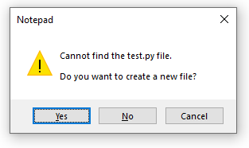

## Overview

This section will focus on setting up a local projects folder using the terminal.

!!! note

    The terms "command prompt" and "terminal" are **interchangable**. Windows calls it the "command prompt", whereas developers often use the word "terminal". This document will describe the application as the "terminal" in this tutorial in preparation for your computer science degree.

!!! warning

    You must be on a **Windows** operating system to follow this guide without any errors. If you are on a **Mac** or **Linux** operating system, then the following steps may not work for you.

## Opening the Terminal

This section will focus on how to open the terminal on a computer with a Windows operating system.

1.  **Click** on the Windows icon on the bottom left of your screen to access the Start menu.
    

    !!! note

        You can also press the "Windows" key often found at the bottom left of your keyboard.

        

2.  **Type** "_command_" or "_cmd_" into the search bar and **click** on the application shown below to open it:

    

    !!! note

        If there is no search bar, you may also type "cmd" right after accessing the Start menu.

    !!! success

        This window will pop up if you successfully opened the terminal.

        

## Check Python on Computer

This section will ensure that Python is properly installed on your computer.

3.  Check the Python version in the terminal using one of the two commands below:

    > python --version

    or

    > python3 --version

    !!! success

        If Python is installed on your machine, then the terminal should display the version of Python that is installed, as shown in the image below.

        

    !!! failure

        If running command resulted in an error message similar to the likes shown below, then Python is not installed on your machine.

        

        If your machine does not have Python, then download any 3.x.x version of Python [here](https://www.python.org/downloads/). The Python installation wizard will guide you through the process.

## Navigating Directories

This section will focus on how to navigate file directories.

4.  **Type** the following command to list out all directories you are currently in:

    > dir

    a. Afterwards, the terminal should look something like this. Your directories will be **different**.

    

    b. A directory will be labeled as "_< DIR >_".

5.  Choose a directory that you want to put your project folder into.

    a. For example, you can choose existing directory like "Documents" shown in the previous step.

    !!! notes

        Practice good file management. Select a folder that will hold all your future projects and keep it organized.

6.  **Type** the following command to navigate to the chosen directory:

    > cd directory_name

    a. "cd", also known as "chdir", is a command that changes your current working directory to another directory.

    b. "directory_name" is a placeholder name. You can replace it with any directory that is listed when you typed "dir" back in the first step [here](./Setting%20Up%20Your%20Project.md/#navigating-directories).

    !!! danger
    !!! warning

        You must choose a clean directory that has no subdirectories. Choosing a directory with existing folders can lead to potential errors. (Why?)

    !!! success

        Successfully navigating to a directory using the terminal command "cd" will looking something like this:

        

## Create Project Folder

!!! danger

    Should we change to rock_paper_scissor**S**?

1.  **Type** the following command to create the project folder:

    > mkdir rock_paper_scissor

    a. The project name "rock_paper_scissor" can be replaced with any name of your choice. This document will use the name "rock_paper_scissor" as the project name.

2.  **Type** the following command to move into the newly created folder:

    > cd rock_paper_scissor

3.  **Type** the following command to create a Python project with the name "rock_paper_scissor":

    > notepad rock_paper_scissor.py

    a. If you have used your own project name, ensure that the name has the .py extension at the end. Excluding it will result in any code written the file to not run.

4.  **Click** "Yes" when prompted to create a new file

    

## Conclusion

By the end of this section, you will have successfully completed the following using only the terminal:

-   [x] Opening the terminal
-   [x] Navigate through file directories
-   [x] Created a folder to house projects
-   [x] Populate folders with empty files

The next section will focus on coding the game itself, click on the link below.

[Writing Your First Game](./Writing%20Your%20First%20Game.md)
