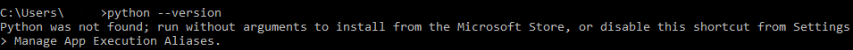
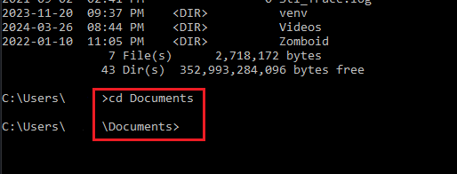

## Overview

This section will focus on setting up a local projects folder using the terminal.

!!! note

    The terms "command prompt" and "terminal" are **interchangable**. Windows calls it the "command prompt", whereas developers often use the word "terminal". This document will describe the application as the "terminal" in this tutorial in preparation for your computer science degree.

!!! warning

    You must be on a **Windows** operating system to follow this guide without any errors. If you are on a **Mac** or **Linux** operating system, then the following steps may not work for you.

## Opening the Terminal

This section will focus on how to open terminal on a computer with a Windows operating system.

1.  **Click** on the Windows icon on the bottom left of your screen to access the Start menu.
    

    !!! note

        You can also press the "Windows" key often found at the bottom left of your keyboard.

        

2.  Type "_command_" or "_cmd_" into the search bar and **click** on the option shown below

    

    !!! note

        If there is no search bar, you may also type "cmd" right after accessing the Start menu.

## Check Python on Machine

This section will focus on ensuring Python is installed on your machine.

4.  Check python version in the terminal using one of the two commands below:

    > python --version

    or

    > python3 --version

    !!! success

        If Python is installed on your machine, then the terminal should display the version of Python that is installed, as shown in the image below.

        

    !!! failure

        If running command resulted in an error message similar to the likes shown below, then Python is not installed on your machine.

        

    !!! note

        If your machine does not have Python, then download any 3.x.x version of Python [here](https://www.python.org/downloads/). The Python installation wizard will guide you through the process.

## Navigating Directories

This section will focus on how to navigate file directories.

5.  Type in the command below to list out all directories you are currently in:

    > dir

    !!! notes

        Choose a directory that you want to put your project folder into

6.  Navigate to the chosen directory

    > cd directory_name

        a. directory_name is a filler name, replace it with any directory that is listed when you typed "dir" back in step 5

        b. If the directory you chose has sub directories, repeat steps 1 and 2 until you are in the directory you wish for your project to reside in.

## Create Project Folder

7. Make the projects folder
    > mkdir rock_paper_scissor

**Note:** The project name rock_paper_scissor can be replaced with any project name of your choice, for the purposes of the demo we will use the name rock_paper_scissor. Any subsequent steps that use the rock_paper_scissor can be replaced with whatever name you have chosen, as long as the name is the exactly same throughout.

8.  Move into the created folder

    > cd rock_paper_scissor

9.  Create source code file

    > notepad rock_paper_scissor.py

        a. If you have used your own project name, ensure that the name has the .py extension at the end. Excluding it will result in any code written the file to not run.

10. Click "Yes" when prompted to create a new file

    

## Conclusion

By the end of this section, you will have successfully completed the following using only the terminal:

-   [x] Opening the terminal
-   [x] Navigate through file directories
-   [x] Created a folder to house projects
-   [x] Populate folders with empty files

The next section will focus on coding the game itself, click on the link below.

[Writing Your First Game](./Writing%20Your%20First%20Game.md)
