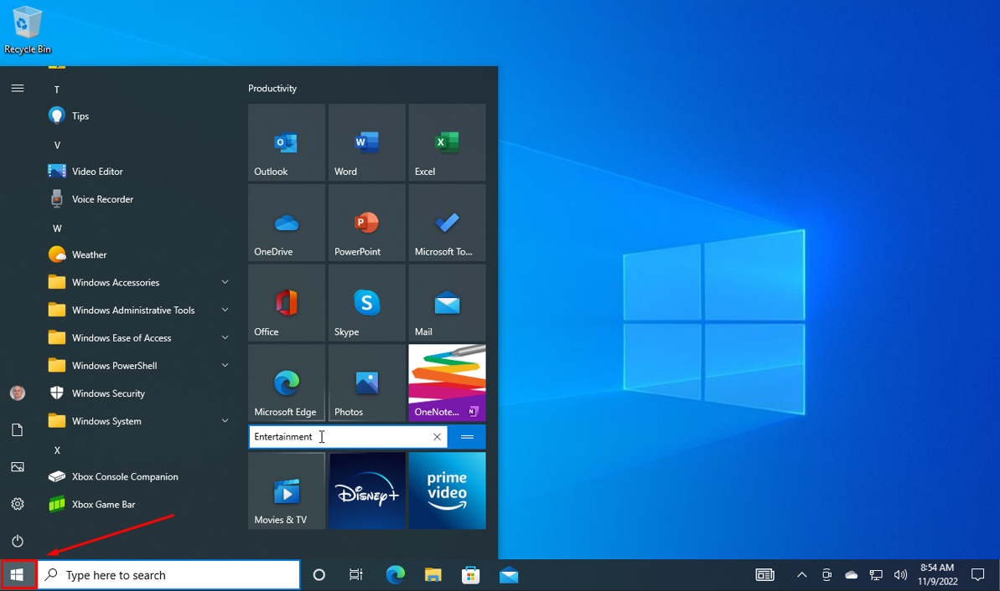

## Overview

This section will focus on setting up a local projects folder using the :octicons-terminal-24: terminal.

!!! note

    The terms "command prompt" and "terminal" are **interchangable**. Windows calls it the "command prompt", whereas developers often use the word "terminal". This document will describe the application as the "terminal" in this tutorial in preparation for your computer science degree.

!!! warning

    You must be on a **Windows** operating system to follow this guide without any errors. If you are on a **Mac** or **Linux** operating system, then the following steps may not work for you.

    Please read the typographical conventions [here](./index.md/#typographical-conventions) before continuing. Remember to press the "enter/return" key after typing in the terminal commands.

## Opening the Terminal

This section will focus on how to open the :octicons-terminal-24: terminal on a computer with a Windows operating system.

1.  _Click_ on the :material-microsoft-windows: Windows icon on the bottom left of your screen to access the "Start menu".
    

    !!! note

        You can also press the "Windows" key often found at the bottom left of your keyboard.

        

2.  _Type_ "command" or "cmd" into the search bar and _click_ on the "Command Prompt" application shown below to open it:

    ```
    command
    ```

    or

    ```
    cmd
    ```

    

    !!! note

        If there is no search bar, you may also type "cmd" right after accessing the Start menu.

    !!! success

        This window will pop up if you successfully opened the terminal.

        

## Checking for Python on Computer

This section will ensure that [Python](https://www.python.org/) is properly installed on your computer using the :octicons-terminal-24: terminal.

3.  Check the Python version in the terminal by typing one of the two commands below:

    ```
    python --version
    ```

    or

    ```
    python3 --version
    ```

    a. If "python" does not work, then try "python3" instead.

    !!! success

        If Python is installed on your machine, then the terminal should display the version of Python that is installed, as shown in the image below.

        

    !!! failure

        If running command resulted in an error message similar to the likes shown below, then Python is not installed on your machine.

        

        If your machine does not have Python, then download any 3.x.x version of Python [here](https://www.python.org/downloads/). The Python installation wizard will guide you through the process.

## Navigating Directories

This section will focus on how to navigate file directories using the :octicons-terminal-24: terminal.

1.  List out all directories you are currently in by _typing_ the following:

    ```
    dir
    ```

    a. Afterwards, the terminal should look something like this. Your directories will be _different_.

    

    b. A directory will be labeled as "_< DIR >_".

2.  Choose a directory that you want to put your project folder into.

    a. For example, you can choose an existing directory like `Documents` shown in the previous step.

    !!! notes

        Practice good file management. Select a folder that will hold all your future projects and keep it organized.

3.  Navigate to the chosen directory by _typing_ the following:

    ```
    cd directory_name
    ```

    a. "cd", also known as "chdir", is a command that changes your current working directory to another directory.

    b. `directory_name` is a placeholder name. You can replace it with any directory that is listed when you typed "dir" back in the first step [here](./Setting%20Up%20Your%20Project.md/#navigating-directories).

    !!! success

        Successfully navigating to a directory using the terminal command "cd" will looking something like this:

        

## Creating Project Folder

This section will focus on how to create a project folder using the :octicons-terminal-24: terminal.

7.  Create the project folder by _typing_ the following:

    ```
    mkdir rock_paper_scissor
    ```

    a. The project name `rock_paper_scissor` can be replaced with any name of your choice. This document will use the name `rock_paper_scissor` as the project name.

8.  Move into the newly created folder by _typing_ the following:

    ```
    cd rock_paper_scissor
    ```

    a. Your terminal should look like this if you have created the `rock_paper_scissor` directory and navigated to it.

    

    !!! failure

        

        If you cannot find the path specified, then go back to the first step [here](./Setting%20Up%20Your%20Project.md/#creating-project-folder).

9.  Create a Python file with the name `rock_paper_scissor` by _typing_ the following:

    ```
    notepad rock_paper_scissor.py
    ```

    !!! warning

        If you have used your own project name, ensure that the name has the Python `.py` extension at the end. Excluding it will prevent the written code from running in Python.

10. _Click_ "Yes" when prompted to create a new file.

    

11. Check if the `rock_paper_scissor.py` file is in your current directory by _typing_ the following:

    ```
    dir
    ```

    !!! success

        If you're successul, you will see the `rock_paper_scissor.py` file inside the `rock_paper_scissor` directory.

        It should *not* be labelled with < DIR > because it is a file.

        

    !!! warning

        If you do not see the `rock_paper_scissor.py` file inside the `rock_paper_scissor` directory, then you must return [here](./Setting%20Up%20Your%20Project.md/#creating-project-folder) and follow the instructions again before proceeding with writing the code.

        Do *not* close the terminal. This guide will refer back to the terminal to activate other commands.

## Conclusion

By the end of this section, you will have successfully completed the following using only the terminal:

-   [x] Opened the terminal.
-   [x] Navigated through file directories.
-   [x] Created a directory for a project.
-   [x] Populated a folder with a file.

The next section will focus on coding the game itself. Please proceed to _Writing Your First Game_.
