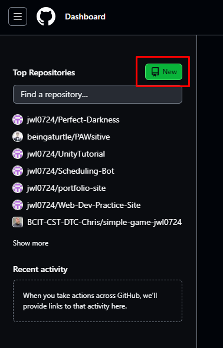
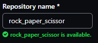
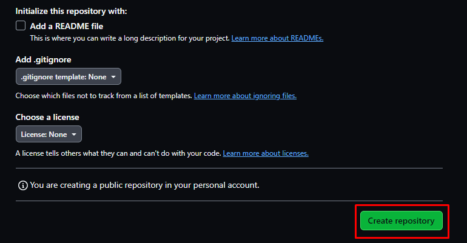
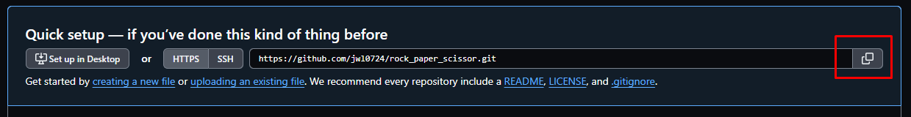
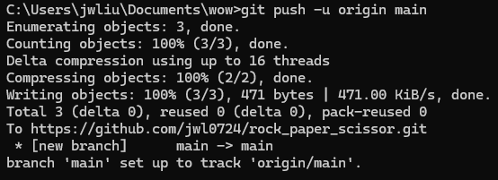

## Overview
This section will focus uploading your code onto [GitHub](https://github.com/). It is platform that hosts git repositories onto cloud, and allows developers to collaborate with each other. This section also assumes that you already have an [GitHub](https://github.com/) account. If you do not have a [GitHub](https://github.com/) account, click [here](https://github.com/join) and follow the steps of the sign-up page.

## Initializing Local Git Repository

This section focuses on creating a .git file to allow for version control in the terminal.

1. Create .git file in the terminal
> git init

    a. .git files are version control systems that allows developers to create different versions as they develop software, allowing for version rollbacks if any major mistakes occur. Almost every software developer uses some form of version control, and should not be underplayed in terms of importance.

## Add Code to Git

This section focuses on adding your newly created game into version control.

2. Stage file in the terminal
> git add rock_paper_scissor.py

3. Commit file in the terminal
> git commit -m "I made my first game!"

    a. Everything in quotations after -m is a message that tells other developers what changes you made, you can replace the message with anything you like as long as it is wrapped in quotations.

## Create Online Repository on GitHub

This section focuses on creating an online repository for you to upload your project to.

4. Login to [GitHub](https://github.com/) and create a new repository as highlighted below.

    

5. Enter a repository name

    

    a. If your project folder name is not rock_paper_scissors, enter the name you used instead.

6. Click create repository

    

**Note:** Advanced users can choose customize their repository settings, for the purposes of the tutorial we will leave everything to default.

## Connecting Local Repository to Cloud

This section focuses on connecting your local .git folder to the online GitHub repostiory.

7. Copy the new GitHub repository link
    

8. Link remote repository to local repostiory
> git remote add origin https://github.com/your_github_username/rock_paper_scissor.git

    a. The link after origin should be replaced with the link you copied into your clipboard outlined in step 1 of this section.

9. Upload local repostiory to cloud repostiory
> git push -u origin main

    a. Your terminal should look like the picture below after pressing enter.
    
    

10. Visit the GitHub repository to ensure changes have been made.

## Conclusion
By the end of this section, you will have successfully completed the following tasks important to every developer:

- [x] Initialize a local repository
- [x] Stage and commit files to a repository
- [x] Create an online GitHub repository
- [x] Connect a local repository to an online repository

**Congratulations!** 🥳🎉, you have taken your first steps towards becoming a fully fledged developer. If you have encountered any problems throughout the tutorial, the next section is a compilation of commonly encountered issues, click the link before to see the next section.

[Troubleshooting](Troubleshooting.md)
