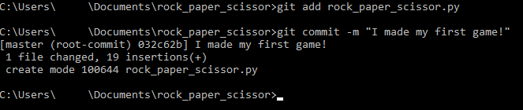
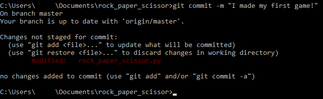
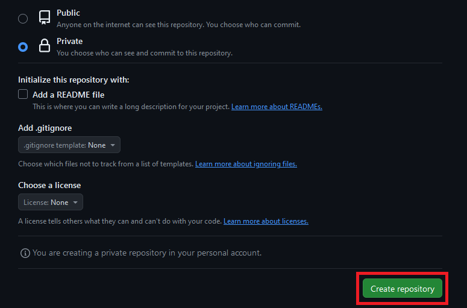
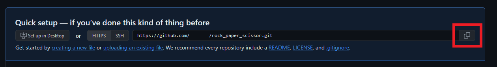
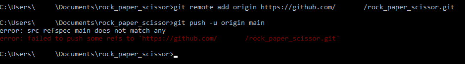

## Overview

This section will focus uploading your code onto :material-github: [GitHub](https://github.com/). It is platform that hosts git repositories onto the cloud, which allows developers to collaborate with each other.

!!! warning

    Ensure that your terminal is in the `rock_paper_scissor` directory that you created previously in :file_folder: [Setting Up Your Project](./Setting%20Up%20Your%20Project.md/#creating-project-folder).

    Ensure that you have a GitHub account. If you do not have a GitHub account, click [here](https://github.com/join) and follow the steps to create an account.

## Initializing Local Git Repository

This section focuses on creating a `.git` directory to allow for version control in the terminal.

1.  Create a `.git` directory in the terminal by _typing_ the following:

    ```
    git init
    ```

    a. The "git init" command creates a new Git repository. It is the first step in implementing version control to your project.

    b. The `.git` directory is part of the version control system that allows developers to create and retrieve different versions of any project. This allows for version rollbacks if any major mistakes occur.

    !!! success

        Successfully creating a `.git` directory will look like this:

        

    !!! notes

        Professional software developers will use some form of version control for work and for their personal projects.

        You will not be able to see the `.git` directory because it is *hidden* by default.

## Adding Code to Git

This section focuses on adding your newly created game into version control.

2.  Stage file in the terminal by _typing_ the following:

    ```
    git add rock_paper_scissor.py
    ```

    a. The "git add" command stages the file. Staging a file means that you have marked a modified file in its current version to go into the next commit.

3.  Commit file in the terminal by _typing_ the following:

    ```
    git commit -m "I made my first game!"
    ```

    a. Commits can be thought of as snapshots or milestones along the timeline of a project. A "git commit" command captures a state of a project at that point in time.

    b. Everything in quotation marks after "-m" is a message that tells other developers what changes you made for the current commit. You can replace the message with anything you like as long as it is wrapped in quotation marks.

    !!! success

        Successfully committing your code to your local .git directory will look like the following:

        

    !!! failure

        If you forget to "git add" to stage a file after modifying it, then the following message will be shown:

        

        Stage the file and then commit the file to fix this issue.

    !!! notes

        A good practice is to have clear and concise messages that tell other developers what you changed in your commit.

## Creating Online Cloud Repository on GitHub

This section focuses on creating an online cloud repository for you to upload your project to.

4.  Login to [GitHub](https://github.com/) and create a new repository as highlighted below:

    

    a. _Click_ on the "+" sign first

    b. _Click_ on "New repository" next.

5.  Enter a repository name by _typing_ the following:

    

    a. If your project folder name is not `rock_paper_scissor`, enter the name you used instead.

6.  Create repository by _clicking_ the following:

    

    a. You may change the project visibility to private, so that only you and your project collaborators can view the project.

    b. All other settings can be left as default.

    !!! success

        Successfully creating the `rock_paper_scissor` repository will move you to the next page shown below:

        

        This newly created cloud repository will host your project, and make it easy for you to access the project remotely.

## Connecting Local Repository to Cloud Repository

This section focuses on connecting your local .git folder to the cloud GitHub repository.

7.  Copy the new GitHub repository link:
    

    a. _Click_ on the "copy" button that is highlighted.

8.  Use the terminal to link your local repository to the cloud repository by _typing_ the following:

    ```
    git remote add origin https://github.com/your_github_username/rock_paper_scissor.git
    ```

    a. The "git remote add origin" command sets up a remote repository with the name "origin" at the address that follows.

    b. In Git, "origin" is a shorthand name for the cloud repository that a project was originally cloned from.

    c. The link after the word "origin" should be replaced with the link you copied into your clipboard in the previous step.

    !!! notes

        You may CTRL + V to paste in the terminal. Some Windows version also allow _right-clicking_ in the terminal to paste.

9.  Upload local repository to cloud repository by *typing* the following:

    ```
    git push -u origin master
    ```

    a. The option "-u" means to set "upstream". It configures the local branch to track the remote branch.

    b. "master" is the default name given to the first branch present in a Git repository when it is initialized.

    c. Some users will have "master" as a default name, while some others will have "main" as a default name. If you encounter an error, try the other.

    !!! success

        Successfully uploading the local repository to the remote repository will look like the following:

        

    !!! failure

        If you type another common branch name like "main", then there is a chance that you will get a "refspec" error shown below:

        

        If "main" does not work, try "master". If "master" does not work, try "main".

10. Visit the GitHub repository to ensure changes have been made:

    !!! success

        Successfully uploading the project on to your GitHub repository should look like the following:

        

## Conclusion

By the end of this section, you will have successfully completed the following tasks important to every developer:

-   [x] Initialized a local repository.
-   [x] Staged and committed files to a repository.
-   [x] Hosted an GitHub repository online.
-   [x] Connected a local repository to a cloud repository in GitHub.

**Congratulations!** 🥳🎉

You have taken your first steps towards becoming a full-fledged developer. If you have encountered any problems throughout the tutorial, the next section is a compilation of commonly encountered issues.

:material-cog-box: [Troubleshooting](Troubleshooting.md)
