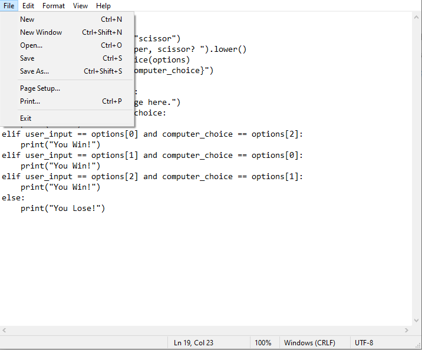
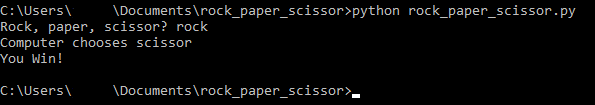
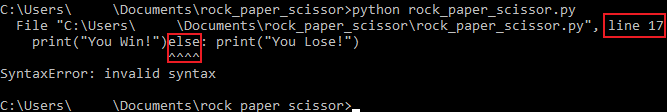
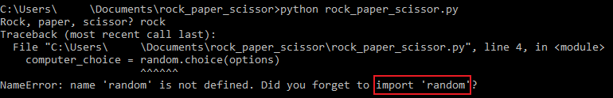

## Overview

This section will focus on coding a simple game of rock paper scissor in Python.

!!! note

    Variable names in code are *case-sensitive*. If you wish to use your own variable names, please ensure that they are consistent throughout the entire file.

    A common mistake that developers make is incorrectly typing a variable name, which could cause errors in the program.

!!! warning

    You must have the `rock_paper_scissor.py` file opened in notepad before proceeding.

    Please read the typographical conventions [here](./index.md/#typographical-conventions) before continuing. Remember to press the "enter/return" key after typing the line(s) of code.

## Preparing Game Variables

This section will setup the variables that are needed for the game.

1.  Import the random module by _typing_ the following:

    ```py
    import random
    ```

    a. The first line of code imports the _random_ module, which possesses a series of functions for generating or manipulating random integers.

    b. This program will be using the random module randomly generate rock, paper, or scissor for the computer opponent.

    !!! notes

        The "import" keyword lets you import entire modules with helpful functions into your code. This allows you to reuse code that you (or others) have created in any project.

2.  Initialize all options by _typing_ the following:

    ```py
    options = ("rock", "paper", "scissor")
    ```

    a. This line of code sets "rock, paper, scissor" as a tuple with the variable name "options".

    b. A tuple is a collection of data. It is a data structure that cannot be modified. Tuples use parentheses to define their elements.

    c. Later, you will use the "random" module to access functions that randomly choose between rock, paper, and scissor.

3.  Get player choice by _typing_ the following:

    ```py
    user_input = input("Rock, paper, or scissor? ").lower()
    ```

    a. This line of code pauses the program, displays the prompt "Rock, paper, or scissor?", and waits for a player to type something into the program.

    b. .lower() is a command that returns the lowercase string from the given string. In this case, any string that the user inputs will always be lowercase.

    c. For example, "rOcK" will be "rock" when .lower() is used. This reduces the chance of user error by narrowing down the user input.

4.  Get computer choice by _typing_ the following:

    ```py
    computer_choice = random.choice(options)
    ```

    a. This line of code randomly selects "rock", "paper", or "scissor" from the tuple initialized back in _step 2_ of ["Prepare Game Variables"](./Writing%20Your%20First%20Game.md/#preparing-game-variables).

    b. The choice() method (from the "random" module) returns a randomly selected element from the specified sequence.

5.  Print out computer's choice by _typing_ the following:

    ```py
    print(f"Computer chooses {computer_choice}")
    ```

    a. This line of code lets the player know what the computer has chosen as its option.

    b. This line of code uses "f-strings", which is a concise and intuitive way to display variables in strings.

    c. print() is a function that outputs text or variables for the user to read.

    d. For example, print("Hello World!") will output "Hello World!" for the user to read.

## Implementing Game Logic

This section will focus on implementing the logic flow that determines who wins the rock, paper, scissor game.

6.  Handle invalid choices by _typing_ the following:

    ```py
    if user_input not in options:
        print("Funny error message here.")
    ```

    a. This line of code checks if the user input is valid choice using the tuple initialized in _step 2_ of the [previous section](./Writing%20Your%20First%20Game.md/#preparing-game-variables).

    b. "not" is a conditional statement that executes a block of code evaluates to false.

    c. "in" is an operator that checks whether a value exists in the given sequence.

    d. If neither "rock", "paper", nor "scissor" is typed in, then the program will print an error message.

    e. The "if" keyword is a conditional statement used to execute a block of code only when a specific condition is met.

    !!! notes

        It is good practice to let the user know what kind of error they incurred.

        For example, the error message should let the user know that they should be typing in "rock", "paper", or "scissor" into the program.

    !!! warning

        Python uses indentation/white space as a way to interpret which group of statements belong to a particular block of code.

        Press the "tab" key to properly indent your code. You may also press the "space" key four times to mimic one "tab" press.

7.  Handle ties by _typing_ the following:

    ```py
    elif user_input == computer_choice:
        print("Tie!")
    ```

    a. The "==" operator compares the value or equality between two objects.

    b. In this case, this line of code checks if the user input is the same as the computer's choice. If it is the same, then the program will print "Tie!".

    c. The "elif" keyword, also known as "if-else", often follows after an "if" statement. It functions the same as an "if" statement.

8.  Handle user choice of rock by _typing_ the following:

    ```py
    elif user_input == options[0] and computer_choice == options[2]:
        print("You Win!")
    ```

    a. This line of code compares the player's "rock" choice to the computer's "scissor" choice, which will result in the player winning.

    b. [0] is the first element of the "options" tuple, so options[0] is "rock".

    c. [2] is the third element of the "options" tuple, so options[2] is "scissor".

    !!! notes

        In programming, many data structures start counting at 0 instead of 1.

9.  Handle user choice of paper by _typing_ the following:

    ```py
    elif user_input == options[1] and computer_choice == options[0]:
        print("You Win!")
    ```

    a. This line of code compares the player's "paper" choice to the computer's "rock" choice, which will result in the player winning.

    b. [1] is the second element of the "options" tuple, so options[1] is "paper".

    c. [0] is the first element of the "options" tuple, so options[0] is "rock".

10. Handle user choice of scissor by _typing_ the following:

    ```py
    elif user_input == options[2] and computer_choice == options[1]:
        print("You Win!")
    ```

    a. This line of code compares the player's "scissor" choice to the computer's "paper" choice, which will result in the player winning.

    b. [2] is the third element of the "options" tuple, so options[2] is "scissor".

    c. [1] is the second element of the "options" tuple, so options[1] is "paper".

11. Handle lose scenario by _typing_ the following:

    ```py
    else:
        print("You Lose!")
    ```

    a. This line of code runs when none of the above requirements are met.

    b. This means that the player loses by default if the player does not meet any of the above requirements.

    c. The "else" statement executes if the "if-else" statements all evaluate to "False".

## Finalizing the Code

If you have followed the instructions correctly, then your file should look similar to the following:

```py
import random

options = ("rock", "paper", "scissor")
user_input = input("Rock, paper, scissor? ").lower()
computer_choice = random.choice(options)
print(f"Computer chooses {computer_choice}")

if user_input not in options:
    print("Funny error message here.")
elif user_input == computer_choice:
    print("Tie!")
elif user_input == options[0] and computer_choice == options[2]:
    print("You Win!")
elif user_input == options[1] and computer_choice == options[0]:
    print("You Win!")
elif user_input == options[2] and computer_choice == options[1]:
    print("You Win!")
else:
    print("You Lose!")
```

!!! notes

    You may add white space between blocks of code to help with code readability.

    For the example above, module imports, variable initializations, and the if-else code blocks were separated by a single line to make them easier to read and distinguish.

## Running the Game

This section will focus on running your game through the terminal.

12. Save the code by _clicking_ the "File" menu then _clicking_ on "Save" as shown below:
    

    !!! notes

        You may also save the file by using the CTRL + S save shortcut on your keyboard.

13. Go back to the terminal from :file_folder: [Setting Up Your Project](./Setting%20Up%20Your%20Project.md).

14. Run the program in the `rock_paper_scissor` directory by _typing_ in one of the following two commands:

    ```
    python rock_paper_scissor.py
    ```

    or

    ```
    python3 rock_paper_scissor.py
    ```

    !!! warning

        Ensure that you are in the `rock_paper_scissor` directory.

        If you did not close the terminal from the previous section, you should still be in the `rock_paper_scissor` directory.

        If you closed the terminal, refer back to "Setting Up Your Project" under the "Navigating Directories" section [here](./Setting%20Up%20Your%20Project.md/#navigating-directories).

15. Enjoy your game!

    !!! success

        If everything is correct, the terminal should look like the image below:

        

    !!! failure

        If there is a syntax error, then check which line can be found. For example, the picture below shows that the error is in line 17, and the error itself is around the "else" keyword. The error can be caused by a lack of indentation, which can lead to statements belonging to the wrong block of code.

        

    !!! failure

        If there is a name error and "random" is not defined, then it is an import error. Add "import random" as the first line of code to fix this issue.

        

    !!! warning

        If your code does not run, please check it [here](./Writing%20Your%20First%20Game.md/#the-final-code-snippet).

## Conclusion

By the end of this section, you will have successfully implemented the following concepts in Python:

-   [x] Imported a Python module
-   [x] Created a command to get user input
-   [x] Generated random values
-   [x] Created a logic flow for a game

The next section will focus on uploading your project onto GitHub, click the link below.

:material-cloud-upload: [Uploading to GitHub](Uploading%20to%20GitHub.md)
